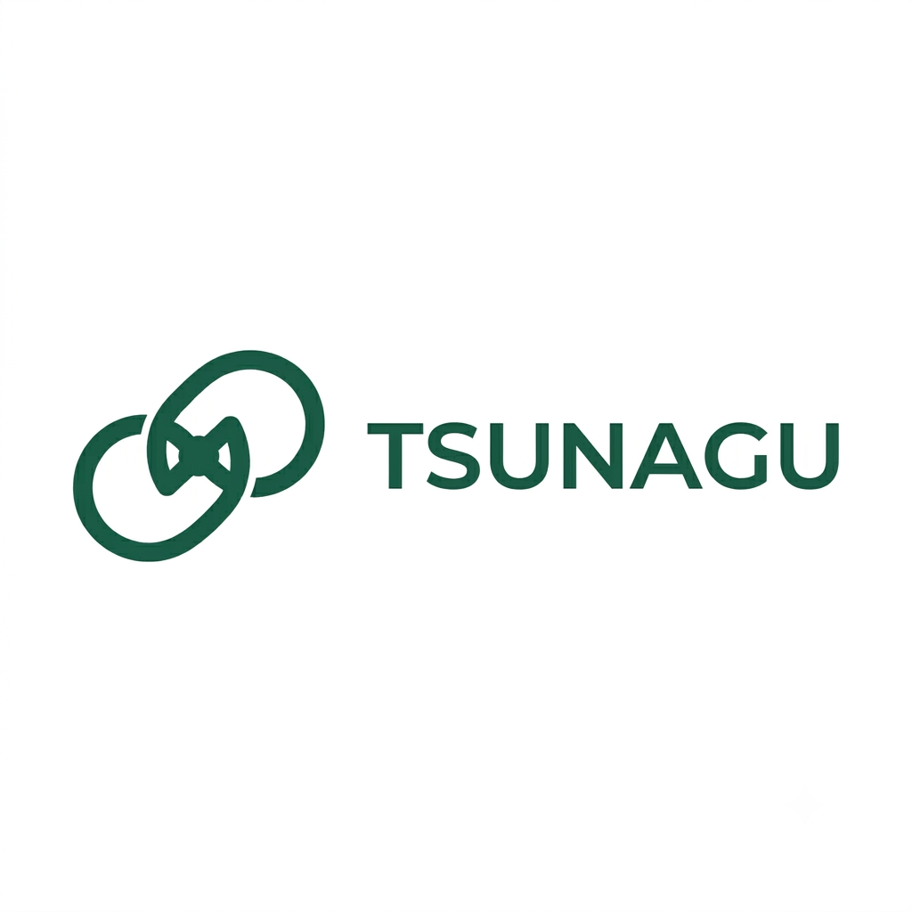
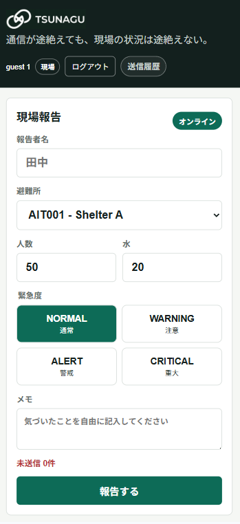
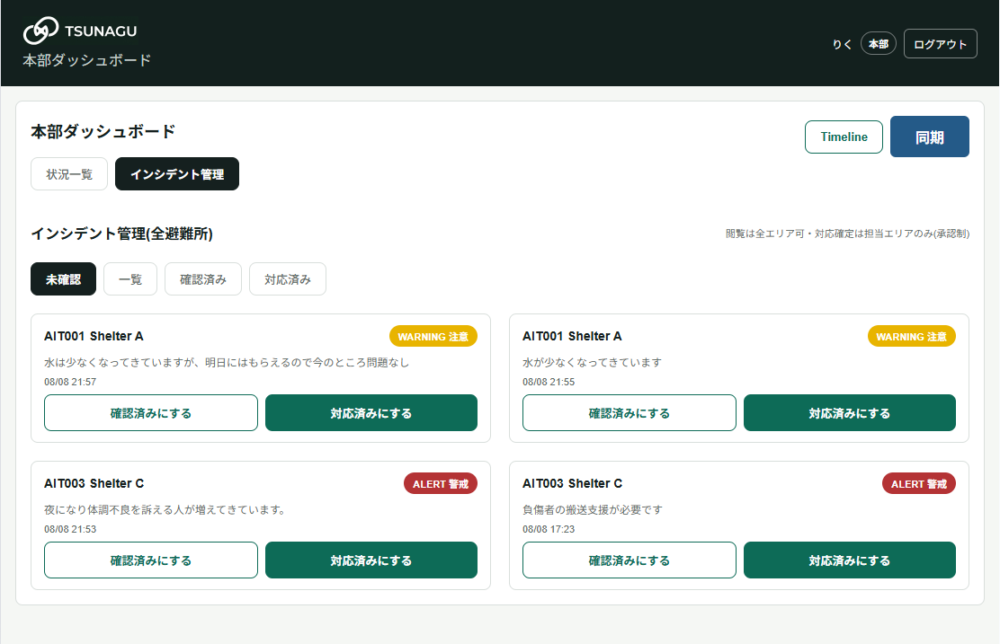
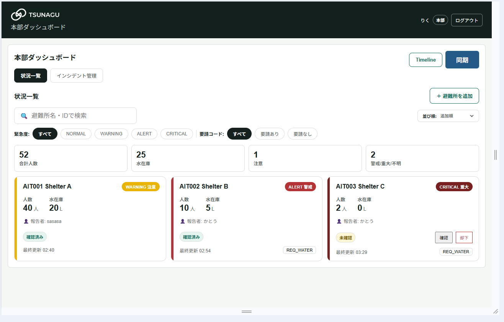
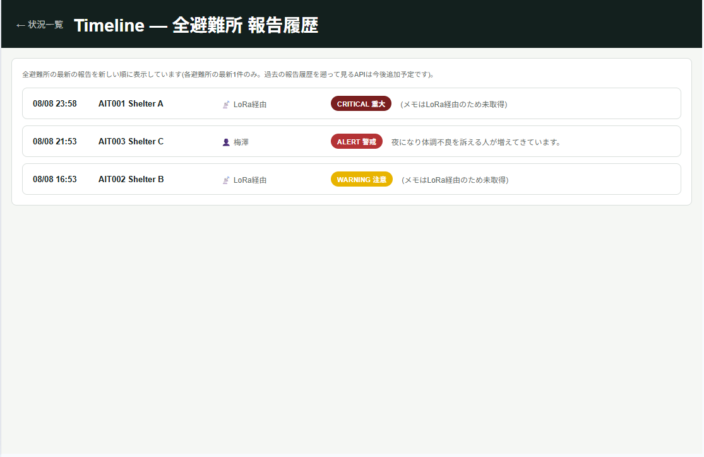
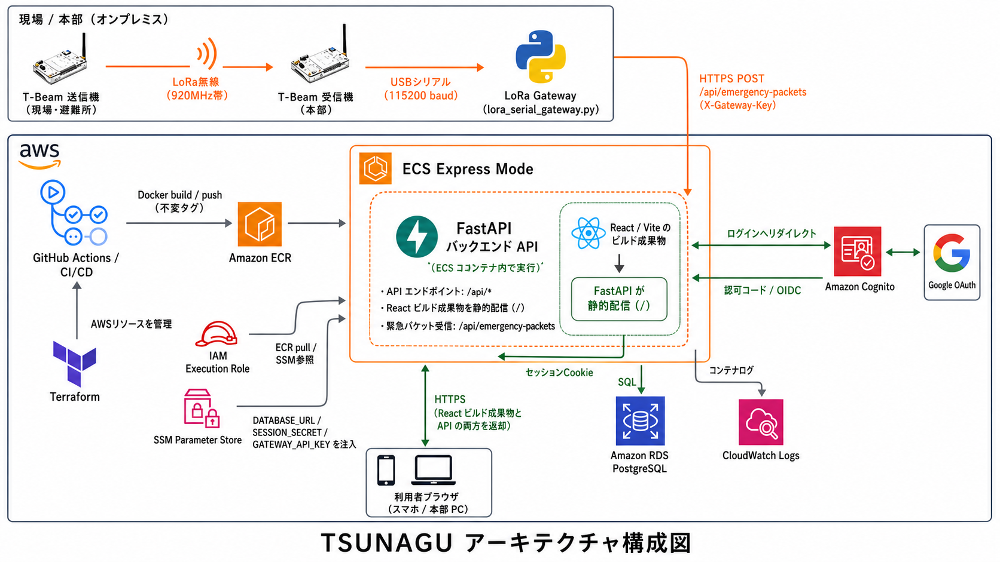

# TSUNAGU

<p align="center">
  
</p>

<p align="center"><strong>通信が途絶えても、現場の状況は途絶えない。</strong></p>

TSUNAGUは、災害時の避難所状況を現場から本部へつなぐ、Offline Firstの情報共有プラットフォームです。通常のインターネット通信では詳細な報告を扱い、通信が途絶えたときは端末内への保存とLoRaによる最低限の状況伝達へ段階的に切り替えます。

> THE HACK 2026 予選作品

## 解決したい課題

災害時には通信障害、停電、道路寸断、人員不足が同時に起きます。すると本部は「どの避難所に何人いるのか」「水がどれだけ残っているのか」「どこに支援を優先すべきか」を把握できなくなります。

課題は情報が遅れることだけではありません。誤った人数、水在庫、緊急度が共有されれば、支援判断そのものを誤らせます。TSUNAGUは、現場からの情報を止めず、受け取った情報を比較・確認できる状態に保つことを目指しています。

## TSUNAGUのアプローチ

### 1. Offline First

通信が不安定でも、現場職員はいつもの報告フォームで入力できます。送信できなかった詳細報告は端末にキューイングされ、接続回復後に同じ識別子で再送されます。サーバーは `client_event_id` で冪等に処理するため、再送やボタン連打で二重保存されません。

### 2. LoRaは最後の伝達手段

通常の通信が一定時間回復しない場合、クラウド版アプリはT-Beamの非常用Wi-Fiへの接続を案内します。スマートフォンはT-BeamにWi-Fi接続し、軽量フォームから人数・水在庫・緊急度・要請コードだけをLoRaで本部へ送ります。

LoRaで送るのは、約45バイトのEmergency Packetです。報告者名やメモなどの詳細・個人情報を無線パケットに載せず、通信制約と情報保護の両方に配慮します。

```text
v1|AIT001|21:04|170|18|WARNING|REQ_WATER
```

### 3. 本部が比較・確認して判断する

本部ダッシュボードでは、避難所ごとの最新状況、要請、緊急度、更新時刻を一覧で比較できます。メモを含む通常報告はインシデントとして管理し、現場の対応済み申請と本部の確認・承認を分けることで、エリアをまたいだ誤操作を防ぎます。

## 画面

<p align="center">
  
</p>

### 現場報告

人数、水在庫、緊急度、メモを大きくシンプルな入力で報告します。報告者名と直近の避難所は端末に保持されるため、繰り返し入力の負担を抑えます。通信状態と未送信件数も画面上で確認できます。

<p align="center">
  
</p>

### 本部ダッシュボード

避難所ごとの最新報告をカードで一覧化し、緊急度・要請の有無・避難所名で絞り込みます。報告の信頼状態も表示し、本部担当者が確認・却下できるようにしています。

<p align="center">
  
</p>

### インシデント管理と履歴

現場で記録された課題は本部で横断的に確認し、対応済みの確定には承認フローを設けています。避難所全体の報告履歴も時系列で追えます。

<p align="center">
  
</p>

## 通信の流れ

| 状態 | 現場での動き | 本部への届き方 |
|---|---|---|
| 通常 | 詳細な報告を送信 | API経由で即時反映 |
| オフライン | 詳細報告を端末内キューへ保存 | 接続回復後に自動再送 |
| 非常時 | T-Beamの非常用Wi-Fiへ接続し、最低限情報を入力 | LoRa -> 受信機 -> Python Gateway -> API |

T-Beam送信機がLoRa送出に成功した時点では、本部での受信までは保証しません。受信確認のACKは今後の拡張項目です。この境界を画面表示でも明確にし、実際の通信状態以上のことを伝えない設計にしています。

## 実装済みの主な機能

- 現場報告: 避難所、人数、水在庫、緊急度、メモ、報告者名
- オフラインキューと接続回復後の再送
- `client_event_id` による通常報告APIの冪等処理
- 避難所別の本部ダッシュボード、検索・絞り込み・並び替え
- 報告履歴、避難所詳細、水在庫の簡易的な推移・予測
- インシデントの確認、対応済み申請、承認フロー
- Googleログインによる本部ロール管理
- Emergency Packetの構文検証、受信ログ保存、ダッシュボードへの反映
- T-Beam送受信、USBシリアル、Pythonゲートウェイを通じたLoRa連携
- Dockerによるローカル起動、TerraformとGitHub ActionsによるAWSデプロイ

## アーキテクチャ

<p align="center">
  
</p>

### 技術スタック

| 領域 | 技術 | 採用理由 |
|---|---|---|
| フロントエンド | React / Vite / PWA | 現場・本部の画面を構成し、端末側の保存と再送を実現 |
| バックエンド | FastAPI / Uvicorn | 入力検証、API、認証コールバック、静的ファイル配信を一体で実装 |
| データベース | PostgreSQL / SQLAlchemy / Alembic | 観測履歴・受信ログ・承認状態を安全に永続化し、スキーマ変更を管理 |
| 非常用通信 | LILYGO T-Beam / LoRa 920MHz / RadioLib | インターネットが使えない状況で最低限の状況を伝達 |
| ゲートウェイ | Python / pyserial / SQLite | USBシリアルの受信を本番APIへ中継し、失敗時も再送キューを保持 |
| クラウド | Amazon ECS Express Mode / RDS / Cognito / SSM / CloudWatch | 実行、永続化、認証、秘密情報、ログ収集を分離 |
| IaC / CI/CD | Terraform / GitHub Actions / OIDC | 環境構築を再現可能にし、長期AWSキーを持たずにデプロイ |

Reactのビルド成果物は、FastAPIが同じコンテナ内から配信します。ブラウザは同一の本番URLで画面とAPIにアクセスします。

## 安全性と信頼性への設計

- **再送安全性**: 同じ報告は重複保存せず、再送を成功として扱います。
- **情報の分離**: LoRaの生パケットログと、ダッシュボード用の観測値を分けて保持します。
- **送信元の記録**: 匿名、認証済み現場、本部、LoRaゲートウェイを区別します。
- **本部認証**: Google OAuthとAmazon Cognitoで本部機能を保護します。
- **秘密情報管理**: DB接続情報、セッション秘密鍵、Gateway API KeyはSSM Parameter StoreのSecureStringで扱います。
- **運用ログ**: コンテナログをCloudWatch Logsへ集約します。

## ローカルで起動する

### 必要なもの

- Git
- Docker Desktop

```powershell
git clone https://github.com/NxTEND-THE-HACK/2026-Team-11.git
cd 2026-Team-11
docker compose up --build
```

起動後は以下を開きます。

- アプリ: [http://localhost:8000](http://localhost:8000)
- APIドキュメント: [http://localhost:8000/docs](http://localhost:8000/docs)

停止するときは、起動中のターミナルで `Ctrl + C` を押した後に実行します。

```powershell
docker compose down
```

## テスト

```powershell
docker compose exec api env PYTHONPATH=. pytest
```

主に、通常報告の冪等性、Emergency Packetの構文検証・重複処理、避難所状態・インシデント・認可を検証しています。

## 今後の展望

- LoRa受信側からのACKによる本部受信確認
- T-Beam非常用ページで入力した詳細情報の安全な同期
- ライフライン、衛生、医療、要配慮者などの報告項目拡張
- 地図表示、ゲートウェイ受信強度、通信経路の可視化
- より高度な水・物資不足予測

TSUNAGUは、現場の入力を減らしながら、本部が「今どこに何が必要か」を判断できる情報基盤へ育てていきます。

## チーム開発

運営リポジトリでは `main` へ直接pushせず、作業ブランチからPull Requestを作成してレビュー・CI通過後にマージします。AWS本番環境はチームのフォークリポジトリで管理し、GitHub Actionsからデプロイします。

## ライセンス

本リポジトリはTHE HACK 2026のチーム開発用成果物です。
